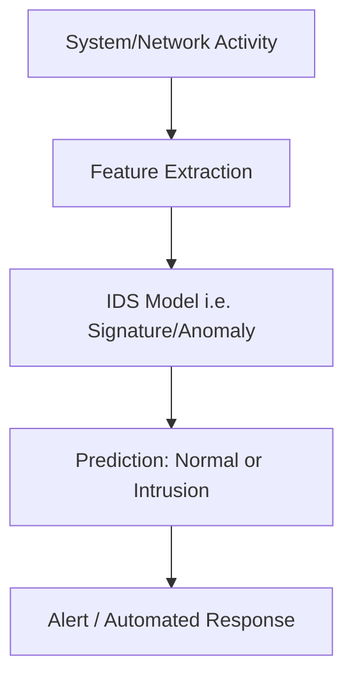

## Overview

Automatic Intrusion Detection Systems (IDS) are security mechanisms designed to **monitor, analyze, and detect unauthorized or abnormal activities** in computer networks or systems. They automate the process of identifying potential threats, reducing reliance on manual monitoring.

---

## Core Concepts

- **Intrusion**: Any unauthorized access or malicious activity within a system or network.
- **IDS Types**:
    - **Network-based IDS (NIDS)**: Monitors network traffic for suspicious activity.
    - **Host-based IDS (HIDS)**: Monitors system logs, file integrity, and processes on individual hosts.
- **Detection Methods**:
    - **Signature-Based**: Matches known attack patterns.
    - **Anomaly-Based**: Detects deviations from normal behavior.
    - **Hybrid**: Combines both approaches for robustness.

---

## Mathematical Formulation

Let:

- ( x ): feature vector representing network traffic or system activity.
- ( y \in {0,1} ): label (0 = normal, 1 = intrusion).
- ( f_\theta(x) ): classifier with parameters ( \theta ).

### Training Objective

[ \theta^* = \arg\min_{\theta} \sum_{i=1}^{n} L(f_\theta(x_i), y_i) ]

Where:

- ( L ): loss function (e.g., cross-entropy).
- ( n ): number of training samples.

### Anomaly Detection Score

[ s(x) = | x - \hat{x} | ]

Where:

- ( \hat{x} ): reconstruction from an autoencoder.
- Large ( s(x) ) indicates potential intrusion.

---

## Workflow

---

## Applications

1. **Enterprise Networks**
    - Detect unauthorized access attempts and malware propagation.
2. **Cloud Infrastructure**
    - Monitor virtual machines and containers for abnormal activity.
3. **Critical Infrastructure**
    - Protect SCADA/ICS systems in energy, transport, and healthcare.
4. **Cyber Threat Intelligence**
    - Identify new attack vectors and patterns.

---

## Challenges

- **False Positives**: IDS may flag benign activity as malicious.
- **Evolving Threats**: Attackers constantly adapt to evade detection.
- **Performance Overhead**: Real-time monitoring can strain resources.
- **Data Volume**: High-speed networks generate massive traffic logs.

---

## Key Insights

- Automatic IDS enhances **real-time detection** and reduces manual workload.
- **Hybrid approaches** combining signature and anomaly detection improve accuracy.
- **Machine learning and deep learning** models are increasingly used to detect sophisticated intrusions.
- IDS is most effective when integrated with **firewalls, SIEM systems, and automated response mechanisms**.
