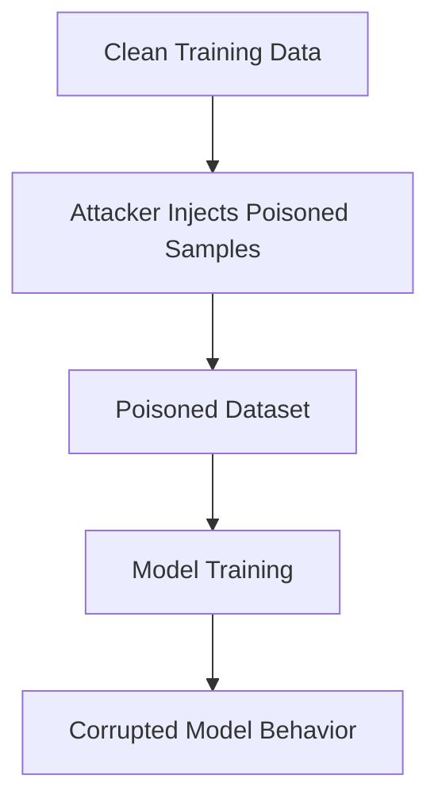

**Data poisoning attacks are adversarial techniques where attackers manipulate training data to corrupt or mislead machine learning models.** They exploit the dependency of AI systems on high-quality data, causing models to misclassify, degrade in accuracy, or behave maliciously.

---
## Overview

Data poisoning is a **cyberattack targeting the training phase of machine learning models**. By injecting malicious or misleading data, attackers alter the model’s behavior. Since ML systems rely heavily on the integrity of training datasets, poisoning can undermine their reliability and security.

---

## Types of Data Poisoning

1. **Targeted Attacks**
    - Aim to manipulate the model’s output in a specific way.
    - Example: Ensuring a spam filter misclassifies certain malicious emails as safe.
2. **Non-Targeted Attacks**
    - Degrade overall model performance without a specific target.
    - Example: Randomly corrupting training data to reduce accuracy across all predictions.

---

## Mathematical Formulation

Let:
- $( D = {(x_i, y_i)}_{i=1}^n )$ be the clean training dataset.
- $( D' = D \cup {(x_p, y_p)} )$ be the poisoned dataset with malicious samples.

The model parameters $\theta$ are learned by minimizing a loss function:

$\theta^* = \arg\min_{\theta} \sum_{(x,y) \in D'} L(f_\theta(x), y)$
Where:

- $f_\theta(x)$: model prediction
- $L$: loss function (e.g., cross-entropy, MSE)

In poisoning, the attacker chooses $(x_p, y_p)$ to maximize error:

$\max_{(x_p, y_p)} ; L(f_{\theta^*}(x_t), y_t)$

for a target sample $(x_t, y_t)$.

---

## Attack Workflow

---

## Applications in Adversarial Contexts

- **Spam Filters**: Poisoned emails cause misclassification.
- **Fraud Detection**: Attackers insert misleading transaction data.
- **Image Recognition**: Altered labels/images degrade accuracy.
- **Cybersecurity**: Poisoned logs or traffic data mislead intrusion detection systems.

---

## Defense Mechanisms

- **Data Validation & Verification**: Ensure integrity of training data via multiple labelers and validation checks.
- **Secure Storage & Transfer**: Encrypt datasets, use secure protocols.
- **Access Control**: Restrict who can modify training data.
- **Robust Training**: Employ anomaly detection, adversarial training, or differential privacy.

---

## Key Insights

- **Data poisoning undermines trust** in AI systems by corrupting their foundation: training data.
- **Targeted vs non-targeted attacks** differ in intent but both compromise reliability.
- **Defenses must combine technical safeguards and operational hygiene** to ensure resilience.
