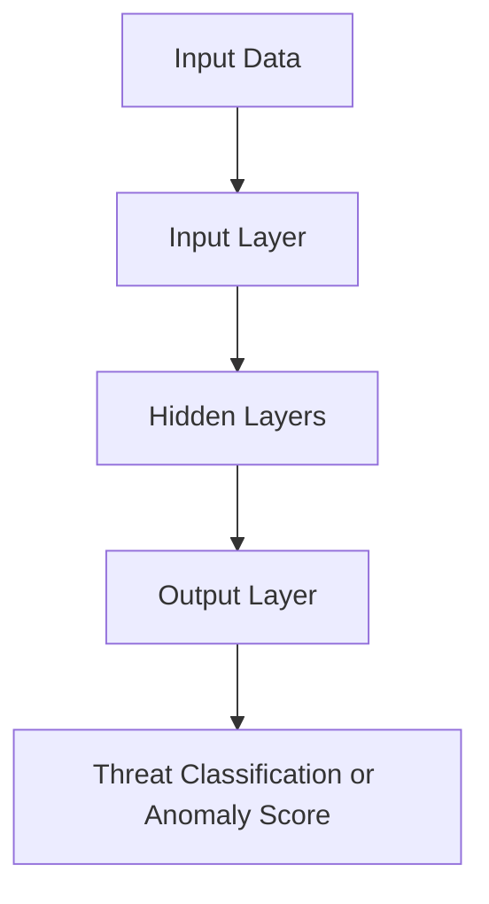

**Deep learning is a subfield of machine learning that uses multi-layered neural networks to model complex patterns in data. In cybersecurity, it enables advanced threat detection, anomaly identification, and real-time response to evolving attacks.**

---

## Deep Learning Basics and Its Applications in Cybersecurity

### What is Deep Learning?

Deep learning is a subset of machine learning that uses **artificial neural networks with multiple layers** (hence "deep") to learn hierarchical representations of data. It excels at capturing intricate patterns in large datasets without manual feature engineering.

---

### Core Concepts

- **Neural Networks**: Composed of input, hidden, and output layers. Each neuron processes inputs using weights, biases, and activation functions.
- **Forward Propagation**: Data flows through the network, layer by layer, to produce an output.
- **Backpropagation**: Errors are propagated backward to update weights using gradient descent.
- **Activation Functions**: Introduce non-linearity (e.g., ReLU, sigmoid) to model complex relationships.
- **Training**: Involves minimizing a loss function over many iterations (epochs) using labeled data.

---

### Operation Flow

---

### Applications in Cybersecurity

1. **Intrusion Detection Systems (IDS)**
    
    - Detects unauthorized access or abnormal behavior in networks.
    - Deep learning models like CNNs and RNNs can learn temporal and spatial patterns in traffic data.
2. **Malware Detection**
    
    - Classifies files or executables as benign or malicious based on byte sequences, API calls, or behavior logs.
    - DL models outperform traditional signature-based methods in detecting zero-day threats.
3. **Phishing Detection**
    
    - Analyzes URLs, email content, and metadata to identify phishing attempts.
    - Recurrent models (e.g., LSTM) can capture sequential patterns in text.
4. **Anomaly Detection**
    
    - Identifies deviations from normal behavior in user activity, system logs, or network flows.
    - Autoencoders and unsupervised DL models are effective for this task.
5. **Threat Intelligence and Prediction**
    
    - Aggregates and analyzes threat feeds, logs, and dark web data to forecast potential attacks.
    - Transformers and attention-based models can extract insights from unstructured data.

---

### Advantages Over Traditional Methods

- **Automated Feature Learning**: No need for manual feature engineering.
- **High Accuracy**: Especially in complex, high-dimensional data.
- **Adaptability**: Learns from evolving threat landscapes.
- **Real-Time Detection**: Enables faster response to threats.

---

### Challenges

- **Data Requirements**: Needs large, labeled datasets.
- **Interpretability**: Models can be black boxes.
- **Adversarial Attacks**: Vulnerable to inputs crafted to deceive the model.

---

Deep learning is transforming cybersecurity by enabling proactive, adaptive, and scalable defense mechanisms. As threats grow more sophisticated, DL’s ability to learn from raw data and detect subtle anomalies is becoming indispensable.

Sources: . Let me know if you'd like a Markdown index comparing DL models used in cybersecurity or a visual of how backpropagation works.