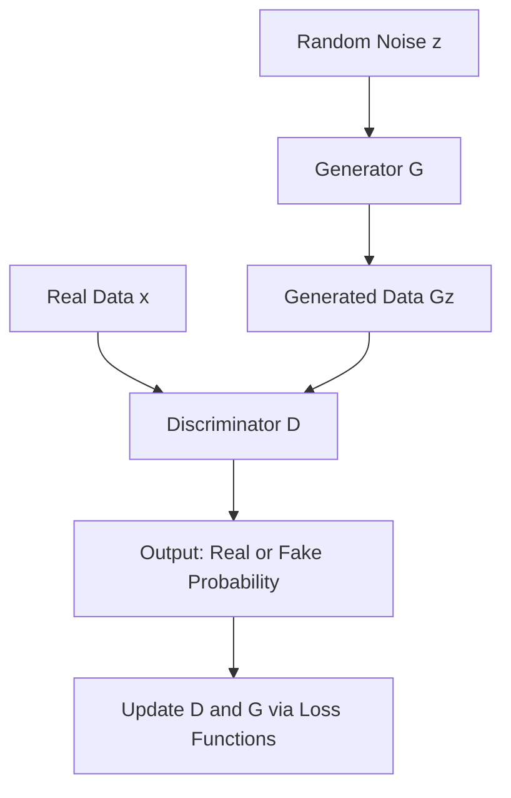

## Architecture

- **Generator (G)**:  
    Takes random noise $z \sim p_z(z)$ as input and produces synthetic data $G(z)$.
    
- **Discriminator (D)**:  
    Takes data $x$ as input and outputs a probability $D(x)$ indicating whether $x$ is real or generated.
    

---

## Mathematical Formulation

### Objective Function

The GAN training objective is a **minimax game**:

$$ \min_G \max_D V(D, G) = \mathbb{E}_{x \sim p_{data}(x)}[\log D(x)] + \mathbb{E}_{z \sim p_z(z)}[\log(1 - D(G(z)))] $$

Where:

- $p_{data}(x)$: distribution of real data
    
- $p_z(z)$: prior distribution of noise (e.g., Gaussian, Uniform)
    

---

### Discriminator Update

The discriminator maximizes:

$$ L_D = \mathbb{E}_{x \sim p_{data}(x)}[\log D(x)] + \mathbb{E}_{z \sim p_z(z)}[\log(1 - D(G(z)))] $$

---

### Generator Update

The generator minimizes:

$$ L_G = \mathbb{E}_{z \sim p_z(z)}[\log(1 - D(G(z)))] $$

Alternative (non-saturating) generator loss for stability:

$$ L_G' = -\mathbb{E}_{z \sim p_z(z)}[\log D(G(z))] $$

---

## Training Workflow

---

## Applications

1. **Image Generation**
    
    - Creating realistic images (faces, objects, art).
        
2. **Data Augmentation**
    
    - Expanding datasets for training models.
        
3. **Super-Resolution**
    
    - Enhancing image quality beyond original resolution.
        
4. **Anomaly Detection**
    
    - Identifying outliers by comparing generated vs real distributions.
        
5. **Cybersecurity**
    
    - Generating adversarial examples to test robustness of models.
        
    - Detecting synthetic attacks by modeling normal vs abnormal traffic.
        

---

## Key Insights

- GANs are powerful but **unstable** to train due to the adversarial dynamics.
    
- Improvements include **DCGAN, WGAN, CycleGAN** for stability and domain-specific tasks.
    
- The equilibrium is reached when $p_g(x) = p_{data}(x)$, i.e., generated distribution matches real distribution.
    
