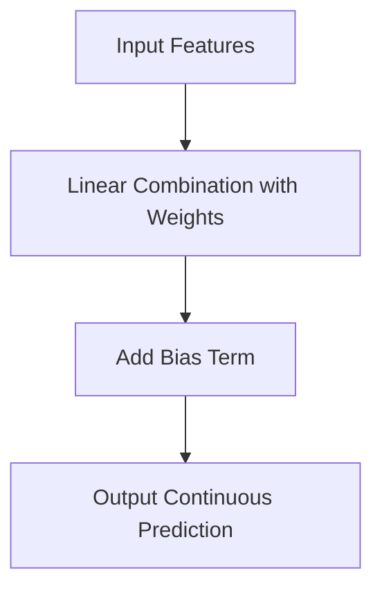

**### Overview

Linear models are foundational tools in machine learning and statistics. They model the relationship between input features and a continuous output using a linear equation. Ridge regression extends linear regression by adding regularization to prevent overfitting.

---

### Linear Regression

#### Objective

To find a linear relationship between input variables $x_1, x_2, ..., x_n$ and a continuous target variable $y$.

#### Model Equation

$y = w_1x_1 + w_2x_2 + ... + w_nx_n + b$

Where:

- $w_i$: weight (coefficient) for feature $x_i$
- $b$: bias (intercept)

#### Training

- Minimize the **Mean Squared Error (MSE)**: $\text{MSE} = \frac{1}{m} \sum_{i=1}^{m} (y_i - \hat{y}_i)^2$

#### Operation Flow

---

### Ridge Regression

#### Motivation

Linear regression can overfit when features are highly correlated or when the number of features exceeds the number of samples. Ridge regression addresses this by penalizing large weights.

#### Modified Loss Function

$\text{Loss} = \text{MSE} + \lambda \sum_{i=1}{n} w_i2$

Where:

- $\lambda$: regularization strength (hyperparameter)
- Penalizes large weights to improve generalization

#### Benefits

- Reduces model variance
- Handles multicollinearity
- Improves stability in high-dimensional spaces

---

### Comparison Table

|Feature|Linear Regression|Ridge Regression|
|---|---|---|
|Output Type|Continuous|Continuous|
|Regularization|None|L2 (squared weights)|
|Overfitting Control|Weak|Stronger|
|Feature Selection|No|No (shrinks but retains all)|
|Use Case|Simple relationships|High-dimensional, noisy data|
