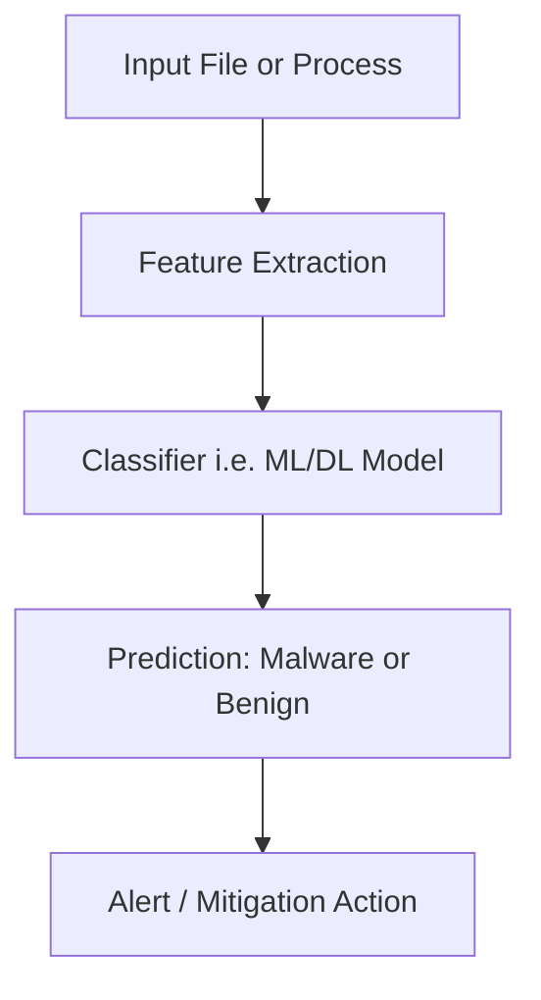

## Overview

Malware threat detection involves identifying malicious software (malware) such as viruses, worms, trojans, ransomware, and spyware. The goal is to protect systems and data by detecting, classifying, and mitigating threats before they cause harm.

---

## Core Concepts

- **Malware**: Software designed to disrupt, damage, or gain unauthorized access to systems.
- **Threat Detection**: Process of monitoring and analyzing system behavior, files, and network traffic to identify malicious activity.
- **Signature-Based Detection**: Matches known malware patterns (hashes, byte sequences).
- **Behavior-Based Detection**: Identifies suspicious activity by monitoring runtime behavior.
- **Machine Learning/Deep Learning**: Learns patterns from benign vs malicious samples to detect unknown malware.

---

## Mathematical Formulation

Let:

- $x$: feature vector extracted from a file or process (e.g., API calls, byte sequences).
- $y \in {0,1}$: label (0 = benign, 1 = malware).
- $( f_\theta(x) )$: classifier with parameters $(\theta)$.

### Training Objective

$\theta^* = \arg\min_{\theta} \sum_{i=1}^{n} L(f_\theta(x_i), y_i)$ 

Where:

- $( L )$: loss function (e.g., cross-entropy for classification).
- $( n )$: number of training samples.

### Detection Probability

$P(y=1|x) = \sigma(w^T x + b)$

Where:

- $( \sigma )$: sigmoid activation function.
- $( w, b )$: learned weights and bias.

---

## Workflow

---

## Techniques

1. **Static Analysis**
    
    - Examines code without execution.
    - Uses signatures, hashes, and disassembly.
2. **Dynamic Analysis**
    
    - Executes code in sandbox environments.
    - Observes runtime behavior (API calls, memory usage).
3. **Hybrid Analysis**
    
    - Combines static and dynamic methods for robustness.
4. **Deep Learning Approaches**
    
    - CNNs for byte-level analysis.
    - RNNs/LSTMs for sequential API call patterns.
    - Autoencoders for anomaly detection.

---

## Applications

- **Endpoint Security**: Antivirus and EDR solutions.
- **Network Security**: IDS/IPS systems detecting malicious traffic.
- **Cloud Security**: Malware detection in virtualized environments.
- **Cyber Threat Intelligence**: Identifying new malware families and variants.

---

## Challenges

- **Polymorphic Malware**: Constantly changes signatures to evade detection.
- **Zero-Day Threats**: Unknown malware not present in signature databases.
- **Adversarial Attacks**: Crafted inputs to bypass ML-based detectors.
- **Performance Trade-offs**: Balancing detection accuracy with system overhead.

---

## Key Insights

- Malware detection requires a **multi-layered approach** combining signatures, behavior, and ML/DL models.
- **Static methods are fast but limited**, while **dynamic methods are robust but resource-intensive**.
- **Deep learning enhances detection of unknown threats**, but adversarial robustness remains a challenge.
