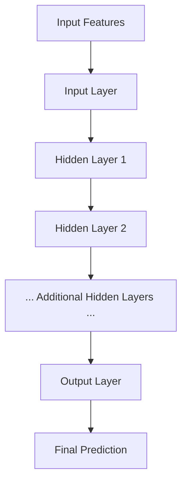

### Overview

A multilayer neural network consists of multiple layers of perceptrons (neurons) arranged sequentially. It can model complex, non-linear relationships and is the foundation of deep learning.

---

### Architecture

- **Input Layer**: Receives raw features.
- **Hidden Layers**: One or more layers that transform inputs using learned weights and activation functions.
- **Output Layer**: Produces final predictions (classification or regression).

---

### Components

- **Neurons**: Each neuron computes a weighted sum of inputs and applies an activation function.
- **Weights and Biases**: Parameters learned during training.
- **Activation Functions**: Non-linear functions like ReLU, sigmoid, or tanh.
- **Forward Propagation**: Data flows from input to output through layers.
- **Backpropagation**: Errors are propagated backward to update weights.

---

### Operation Flow

---

### Training Process

1. **Initialize weights and biases** randomly.
2. **Forward pass**:
    - Compute activations layer by layer.
3. **Loss computation**:
    - Compare predicted output with actual label using a loss function.
4. **Backward pass (Backpropagation)**:
    - Compute gradients of loss w.r.t. weights using chain rule.
    - Update weights using gradient descent or its variants.
5. **Repeat** for multiple epochs over the training dataset.

---

### Advantages

- Can model non-linear and complex relationships.
- Suitable for image, text, and speech data.
- Forms the basis for deep learning architectures like CNNs and RNNs.

---
