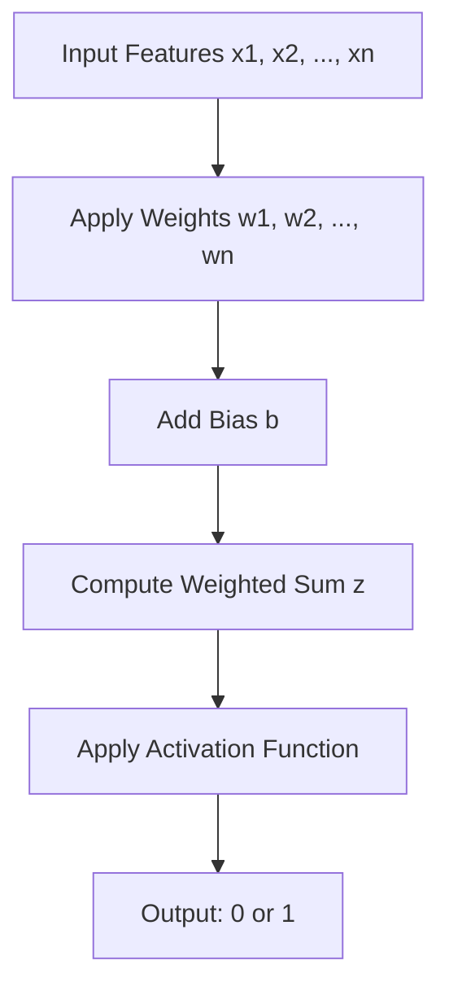

# [[Introduction to Neural Networks]]

---
### Overview

A single perceptron is a basic unit of a neural network used for binary classification. It takes multiple inputs, applies weights and bias, and produces a binary output using an activation function.

---
### Components

- **Inputs**: Feature values ( x_1, x_2, ..., x_n )
- **Weights**: Coefficients ( w_1, w_2, ..., w_n ) assigned to each input
- **Bias**: A constant ( b ) added to the weighted sum
- **Weighted Sum**: ( z = w_1x_1 + w_2x_2 + ... + w_nx_n + b )
- **Activation Function**: Typically a step function that outputs 1 if ( z > 0 ), else 0

---

### Operation Flow

---

### Learning Algorithm

1. **Initialize weights and bias** randomly.
2. **For each training example**:
    - Compute output.
    - Compare with actual label.
    - Update weights and bias using:
        - $w_i = w_i + \alpha \cdot (y - \hat{y}) \cdot x_i$
        - $b = b + \alpha \cdot (y - \hat{y})$
    - Where $\alpha$ is the learning rate, $y$ is the true label, and $\hat{y}$ is the predicted output.

---
### Limitations

- Can only solve linearly separable problems.
- Cannot model complex relationships like XOR without additional layers.
