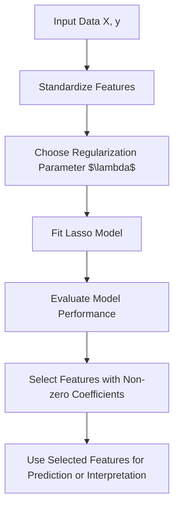

Lasso (Least Absolute Shrinkage and Selection Operator) is a regression analysis method that performs both variable selection and regularization to enhance prediction accuracy and interpretability. It adds an $L_1$ penalty to the loss function, encouraging sparsity in the model coefficients.

---

## Mathematical Formulation

Given a dataset with features $X \in \mathbb{R}^{n \times p}$ and target vector $y \in \mathbb{R}^n$, the Lasso regression solves:

$$ \min_\beta { \frac{1}{2n} | y - X\beta |_2^2 + \lambda | \beta |_1 } $$

Where:

- $\beta \in \mathbb{R}^p$ are the regression coefficients.
    
- $| y - X\beta |_2^2$ is the residual sum of squares.
    
- $| \beta |_1 = \sum_{j=1}^p |\beta_j|$ is the $L_1$ norm promoting sparsity.
    
- $\lambda \geq 0$ is the regularization parameter controlling the strength of the penalty.
    

---

## Key Properties

- Encourages sparsity by shrinking some coefficients exactly to zero.
    
- Performs feature selection implicitly.
    
- Useful when $p$ (number of features) is large compared to $n$ (number of samples).
    
- Helps prevent overfitting by controlling model complexity.
    

---

## Optimization

Lasso optimization is convex but non-differentiable due to the $L_1$ norm. Common algorithms include:

- Coordinate Descent
    
- Least Angle Regression (LARS)
    
- Subgradient Methods
    

---

## Application Workflow

---

## Applications

1. **Feature Selection**
    
    - Identifying important predictors in high-dimensional data.
        
2. **Sparse Modeling**
    
    - Building interpretable models with fewer variables.
        
3. **Genomics and Bioinformatics**
    
    - Selecting relevant genes or biomarkers.
        
4. **Finance**
    
    - Risk modeling and variable selection in portfolio management.
        
5. **Signal Processing**
    
    - Sparse signal recovery and denoising.
        

---

## Key Insights

- Lasso balances bias and variance by tuning $\lambda$.
    
- Larger $\lambda$ values increase sparsity but may increase bias.
    
- Cross-validation is commonly used to select optimal $\lambda$.
    
- Extensions include Elastic Net (combining $L_1$ and $L_2$ penalties) for correlated features.
    

---