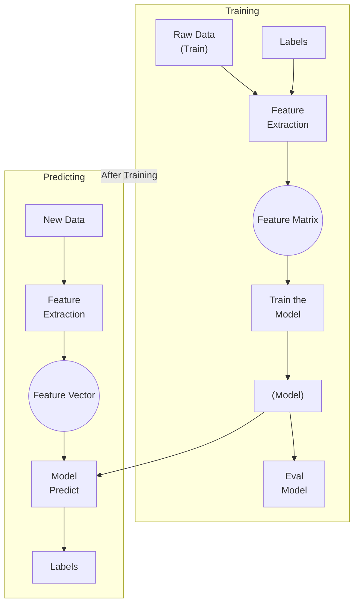

## Defining Supervised Learning
**Goal:** To find a mapping function between the $(x)$ input and $(y)$ output variable.
- type of machine learning algorithms in which the machine learns under supervision
- uses a known
	- **dataset** (called the training dataset) 
	- a **known set of input data** (called features)
	- known responses to make predictions
- To train an algorithm 

It learns the relationship between the input data and the output data.
- The input is called the **Features $x$**
- The output is called the **Target Value $y$** 

