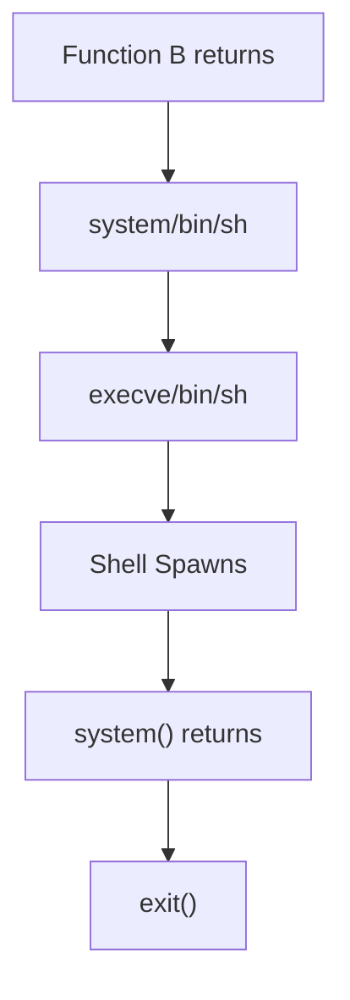

## Overview

Non-malicious program errors are **intentional flaws introduced for convenience, debugging, or oversight**, which violate security policies or expose systems to risk. They are not crafted to harm but can still be exploited by attackers.

---

## Examples of Non-Malicious Errors

### Buffer Overflow (C)

**Concept:** Writing more data into a buffer than it can hold, causing overwriting of adjacent memory.  
**Cause:** Lack of bounds checking in memory operations.  
**Prevention:** Use bound-checked functions, validate input lengths, prefer safer languages or libraries.

---

### Use-After-Free

**Concept:** Accessing memory after it has been freed.  
**Cause:** Invalid memory access after deallocation.  
**Prevention:** Set pointers to NULL post-free, avoid returning freed pointers, use ownership models.

---

### Dangling Pointer

**Concept:** Pointer that refers to memory that is no longer valid (stack frame end or freed memory).  
**Cause:** Returning pointers to out-of-scope objects or freed memory.  
**Prevention:** Never return pointers to local variables; use heap allocation or return by value.

---

### Stack Overflow

**Concept:** Stack memory is exhausted due to deep or infinite recursion or excessively large local variables.  
**Cause:** Unbounded recursion or large stack allocations.  
**Prevention:** Use iterative solutions, reduce recursion depth, avoid large local arrays.

---

## Return-to-libc Exploit (Technical Note)

**Concept:** Exploit where attacker redirects execution into existing libc functions (e.g., `system("/bin/sh")`) by overwriting return addresses.  
**Cause:** Buffer overflow without NX protection.  
**Prevention:** Use ASLR, stack canaries, safe compilers, and memory-safe languages.

---

## Stack Layout: Before vs After Overflow

### Before Overflow

```
|-----------------------------|
| Saved return address → A    |
|-----------------------------|
| Old frame pointer           |
|-----------------------------|
| B's local buffer            |
|-----------------------------|
```

### After Overflow (Crafted)

```
|-----------------------------|
| Address of system()         |
|-----------------------------|
| Address of exit()           |
|-----------------------------|
| Pointer to "/bin/sh"        |
|-----------------------------|
| "/bin/sh\0"                 |
|-----------------------------|
```

---

## Execution Flow



---

## Countermeasures Summary

- Use memory-safe languages (Rust, Java, C#)
- Replace unsafe C functions with safer alternatives
- Enable stack canaries and ASLR
- Apply strict input validation
- Use non-executable stack (NX/DEP)
- Audit code for unsafe memory and logic flaws
