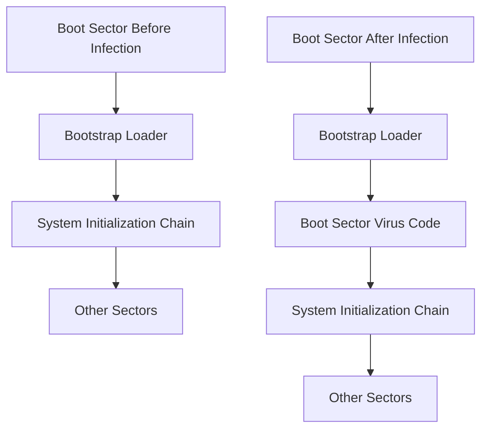

Malicious Program/Code deliberately tries exploit, harm, or compromise systems.

## Overview

Malicious code or rogue programs refer to **unanticipated or undesired effects** in software caused by agents with intent to damage, disrupt, or compromise systems. These threats range from parasitic malware like viruses to independent malware like worms and bots.

---

## Malware Classification

### 1. Parasitic Malware

- Cannot exist independently.
- Relies on host programs to execute.
- Examples: **Viruses**, **Logic Bombs**

### 2. Independent Malware

- Self-contained programs.
- Can run directly under the operating system.
- Examples: **Worms**, **Bot Programs**

---

## Viruses

A virus is a program that:

- Replicates itself.
- Modifies other programs to carry its code.
- Can be **transient** (active only with host) or **resident** (persists in memory).

### Components of a Virus

|Component|Description|
|---|---|
|Infection Mechanism|Method by which the virus spreads (infection vector).|
|Trigger|Condition/event that activates the payload.|
|Payload|The action performed (damage, display, data theft, etc.).|

---

## Virus Lifecycle Phases

1. **Dormant Phase**: Virus is idle.
2. **Propagation Phase**: Virus replicates into other programs or disk areas.
3. **Triggering Phase**: Virus activates based on a condition.
4. **Execution Phase**: Payload is executed.

---

## Virus Attachment Techniques

- **Appended Virus**: Code added before first instruction; last virus instruction jumps to original code.
	- **Compression Virus:** The executable is compressed to make space for the virus and prepends itself to the executable. It later decompresses the executable for execution.
- **Surrounding Virus**: Virus wraps around the program and cleans up traces.
- **Integrated/Replaced Virus**: Virus code replaces or integratepis with host logic.

---

## Virus Classification

### By Target

|Type|Description|
|---|---|
|Boot Sector Virus|Infects boot record; activates during system boot.|
|File Infector|Infects executable files.|
|Macro Virus|Infects documents with macro code (e.g., Word, Excel).|

### By Concealment Strategy

|Type|Description|
|---|---|
|Encrypted Virus|Uses encryption to hide payload; stores key with virus.|
|Stealth Virus|Hides itself from antivirus detection.|
|Polymorphic Virus|Mutates with each infection; signature changes.|
|Metamorphic Virus|Rewrites itself entirely; changes both behavior and appearance.|

---

## Macro Viruses

- Infect documents, not executables.
- Platform-independent (e.g., Microsoft Office).
- Spread easily via email.
- Bypass traditional file system access controls.

---

## Boot Sector Virus Infection Flow

---

