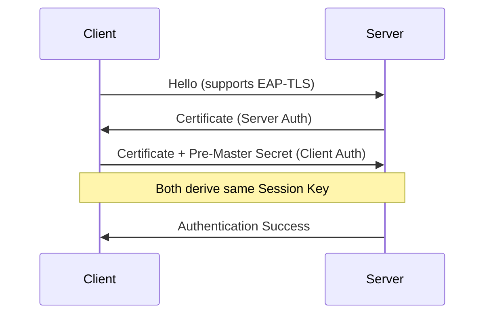
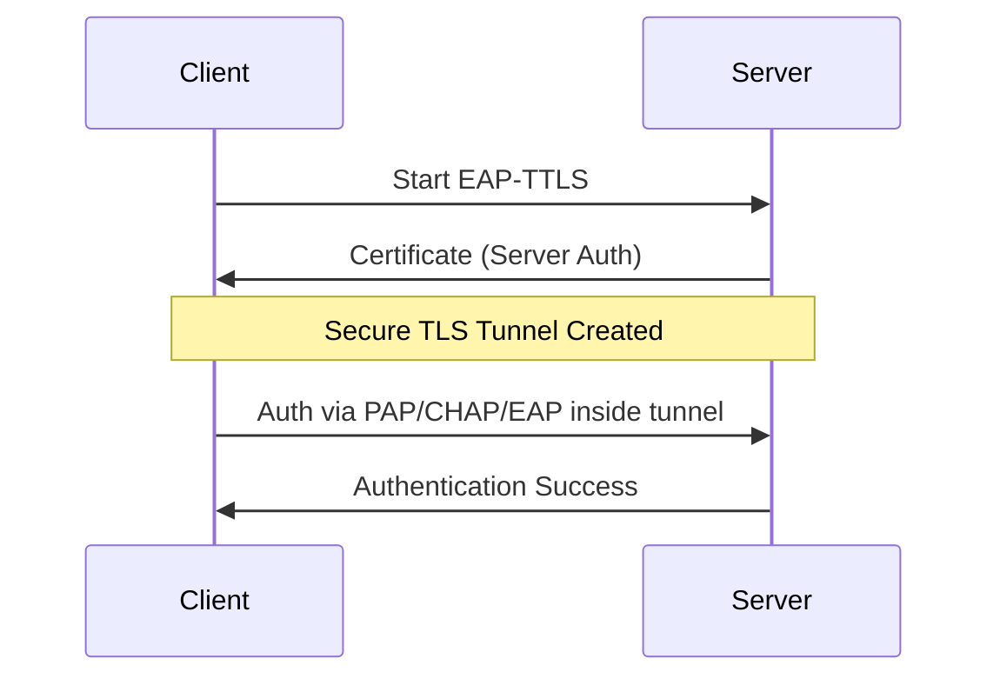
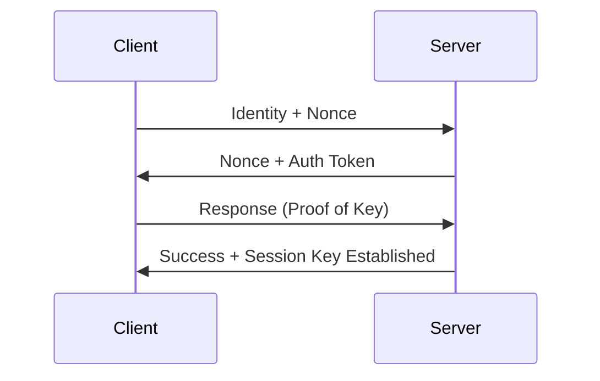
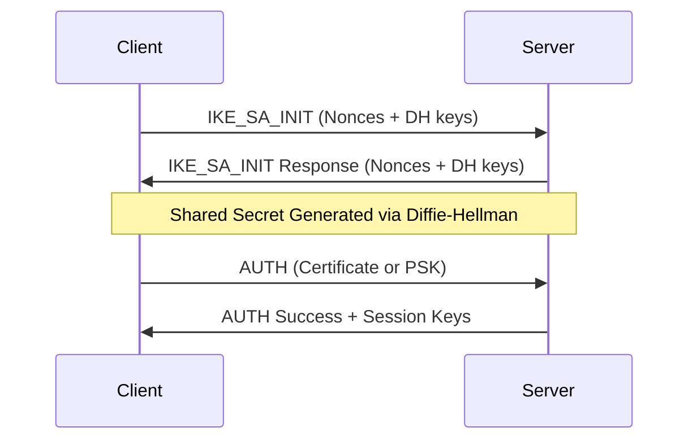

EAP is the framework used for Network Access and Authentication Protocols.

**Purpose:**
- Provides set of protocol messages
- Encapsulate various authentication methods to be used between client & server.
- can operate over variety of networks links
- Provides a generic transport service for exchange of authenticatioon information.

Its called extensible cause it supports a lot of authentication methods. 

![[Pasted image 20251113123804.png]]

---

## EAP Authentication Methods Overview

EAP (Extensible Authentication Protocol) is a **framework** that supports multiple authentication methods.
Each method defines **how the client and server prove their identities** and **establish shared keys**.

---

## EAP-TLS (Transport Layer Security)

**Key idea:** Mutual authentication using certificates.
Both client and server verify each other with digital certificates through the **TLS handshake**.

**Summary:**

* Uses the **TLS handshake**, not TLS encryption itself.
* **Both sides** present certificates.
* The client creates a **pre-master secret** by encrypting a random value with the server’s public key.
* Both sides derive the same **session key** from that pre-master secret.

---

## EAP-TTLS (EAP Tunneled TLS)

**Key idea:** Only the **server** has a certificate.
The client is authenticated inside an encrypted tunnel.

**Summary:**

* Works like EAP-TLS but the client does not need a certificate.
* The server authenticates first and establishes a **secure tunnel**.
* The client then authenticates inside this tunnel using:

  * Another EAP method, or
  * Legacy methods such as **PAP** or **CHAP**.

---

## EAP-GPSK (EAP Generalized Pre-Shared Key)

**Key idea:** Mutual authentication using a **Pre-Shared Key (PSK)**.

**Summary:**

* Uses **symmetric key cryptography**, not certificates.
* **Fast and lightweight**, suitable for resource-limited devices.
* Requires **pre-shared keys** between the client and EAP server, configured beforehand.
* Secure even over **insecure networks** like Wi-Fi.
* Completes in a **minimum of four messages**.

---

## EAP-IKEv2 (Internet Key Exchange v2)

**Key idea:** Mutual authentication and key exchange using **public-key cryptography** or **pre-shared keys (PSK)**.
It is based on the same principles as **IKEv2**, commonly used in VPNs.

**Summary:**

* Based on **IKEv2**, the same protocol used for IPsec VPNs.
* Supports **mutual authentication** using either:

  * Digital certificates, or
  * Pre-shared keys (PSK).
* Uses **Diffie–Hellman key exchange** to establish shared secrets.
* Provides strong resistance to **replay** and **man-in-the-middle attacks**.
* Supports **fast reconnection**, useful for mobile clients that switch networks.

---

## Comparison Table

| EAP Method    | Authentication Type      | Uses Certificates | Cryptography    | Notes                                       |
| ------------- | ------------------------ | ----------------- | --------------- | ------------------------------------------- |
| **EAP-TLS**   | Mutual (Client + Server) | Yes (both sides)  | Public-key      | Most secure, but complex setup              |
| **EAP-TTLS**  | Server only              | Yes (server only) | Public-key      | Simpler setup, supports password-based auth |
| **EAP-GPSK**  | Mutual                   | No                | Symmetric       | Lightweight, requires pre-shared keys       |
| **EAP-IKEv2** | Mutual                   | Yes or PSK        | Public-key / DH | Strong, supports quick reconnection         |

---

Would you like me to add an overview Mermaid diagram showing how **EAP fits between the client, access point, and authentication server** (e.g., RADIUS)? That would make the relationships clearer.

![[Pasted image 20251113125839.png]]

- EAP peer: Client computer that is attempting to access a network.
-  EAP authenticator: An access point or NAS that requires EAP authentication prior to granting access to a network.
- Authentication server: A server computer that negotiates the use of a specific EAP method with an EAP peer, validates the EAP peer’s credentials, and authorizes access to the network. Typically, the authentication server is a Remote Authentication Dial-In User Service (RADIUS) server.