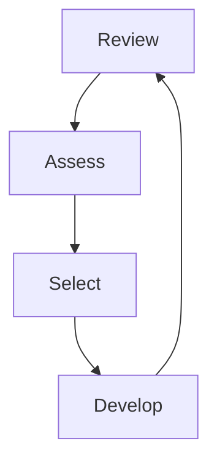

## Understanding the Needs of Agile 

Teams that were geographically dispersed and worked on a single project for extended periods often faced long deployment cycles. This led to inefficiencies in the software development process. To address these challenges, Agile Process Models were developed to promote faster delivery, adaptability, and collaboration.

### Agile Manifesto

Agile Manifesto consists of 4 core values and 12 guiding principles

**Core Values**
1. Individuals and Interaction over processes and tools
2. Working Software over comprehensive documentation
3. Customer collaboration over contract negotiation
4. Responding to change over following a plan

**Guiding Principles**
1. **Customer satisfaction** through early and continuous delivery of valuable software
2. **Welcome changing requirements**, even late in development
3. **Deliver working software frequently**, from a couple of weeks to a couple of months
4. **Close, daily cooperation** between business people and developers
5. **Build projects around motivated individuals**; give them the environment and support they need
6. **Face-to-face conversation** is the best form of communication
7. **Working software is the primary measure of progress**
8. **Sustainable development**, able to maintain a constant pace indefinitely
9. **Continuous attention to technical excellence** and good design
10. **Simplicity**—the art of maximizing the amount of work not done—is essential
11. **Self-organizing teams** produce the best architectures, requirements, and designs
12. **Regular reflection** on how to become more effective, then tune and adjust behavior accordingly

### Agile Methodology vs. Prescriptive Models

| Aspect               | Prescriptive Models                 | Agile Methodology                        |
| -------------------- | ----------------------------------- | ---------------------------------------- |
| Approach             | Sequential and structured           | Iterative and flexible                   |
| Planning             | Extensive upfront planning          | Adaptive planning throughout             |
| Requirements         | Fixed and documented early          | Evolving based on feedback               |
| Delivery             | One final release after development | Continuous delivery in small increments  |
| Team Collaboration   | Limited, often siloed               | High, cross-functional and collaborative |
| Change Management    | Resistant to change                 | Welcomes and adapts to change            |
| Customer Involvement | Minimal after initial requirements  | Continuous involvement and feedback      |
| Documentation        | Comprehensive and formal            | Lightweight and just enough              |
| Risk Handling        | Late detection of issues            | Early and frequent risk mitigation       |
| Examples             | Waterfall, V-Model                  | Scrum, Kanban, XP                        |

### TL

;DR

**Agility:** The capability of the team or organization to rapidly adapt to changing needs
**Agile Process:** A framework for software engineering that promotes iterative delivery, customer collaboration, etc.
**Core Assumptions**: Requirements and Priorities are subject to changes during development
**Design Approach**: Design and construction are interleaved for continuous validation

### Adaptive Software Development in Agile Environment

### Adaptive Software Development
ASD (Adaptive Software Development) is an evolution of Rapid Application Development (RAD).

**Principles of ASD**
1. Speculation
2. Collaboration
3. Learning

ASD in Agile Environment has various benefits:
1. High Adaptability
2. Rapid Delivery
3. Improved Team Dynamics
4. Continuous improvement

### Extreme Programming in Agile Environment

The key difference between incremental development models and plan driven models is that for incremental development models there is no system specifications. XP (Extreme Programming) emphasizes the importance of program testing in incremental development models. XP includes key features likes:
1. Test-first development
2. Incremental test development
3. User involvement in the test development and validation
4. The use of automated testing frameworks

### SCRUM

The Scrum approach is a general agile method that provides management framework for the software project. Scrum doesn't recommend use of programming practices like pair programming and test-first driven approach. It can therefore be used with more technical agile approaches.

There are three phases in Scrum:
##### *Phase I*
First phase is the outline planning phase where you establish the general objectives for the project and design the software architecture

##### *Phase II*
Phase I is followed by a set of sprint cycles. where each cycle develops an increment of the system.
Stages of Sprint Cycle

##### *Phase III*
Finally Phase III, wraps up the project, completes required documentation such as help frames and user manuals.

**Key Characteristics:**
1. Sprints are of fixed lengths. Usually 2-4 weeks.
2. The the starting point for the planning phase is the backlog. During assessment phase this is reviewed and risks and priorities are assigned. The customer is closely involved in this process and can introduce new requirements and tasks are assigned.
3. The selection phase involves all the projects team who works with the customer to select features and functionality to be implemented
4. Once these are agreed, team organizes themselves to develop the software.
5. At the end of each sprint cycle, the work done is reviewed and presented to the stakeholders
6. The idea behind Scrum is that the whole team should be empowered to make decisions so the term ‘project manager’, has been deliberately avoided. Rather, the ‘Scrum master’ is a facilitator who arranges daily meetings, tracks the backlog of work to be done, records decisions, measures progress against the backlog, and communicates with customers and management outside of the team.
7. 